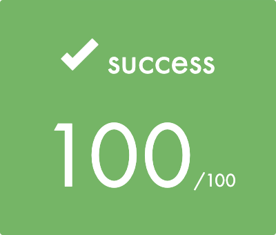

# <h1 align="center">EXAMS ✍🏼️🎓</h1>

<h2> Description exam_02</h2>

In exam_02 you will be tested for 1 of the following excersises and projects:
<li>union</li>          
<li>inter</li>
the second test will be one of the following:
<li>ft_printf</li>
<li>get_next_line</li>

Projects union, inter and ft_printf within this repository are tested and work (05-04-2022).

<h2>Description exam_03</h2>

In exam_03 2 tests will be given. The first one will be:
<li>ft_split</li>
the second test will be one of the following:
<li>ft_remove_if</li>
<li>ft_sort_list</li>

Projects ft_split, ft_remove_if and ft_sort_list within this repository are tested and work (16-09-2022).

<h2>Description exam_04</h2>

In exam_04 you will have to pass 2 tests. The first test will be:
<li>brackets</li>
the second test will be one of the following:
<li>Binary search node</li>
<li>Binary insert node</li>

Project brackets and Binary search within this repository are tested and work (21-05-2023)

<h2>Description exam_05</h2>

In exam 05 you will have to pass 3 tests. They can be different than the ones in this repository. Every test works, in the multiplication test, you still have to deal with negative numbers.

